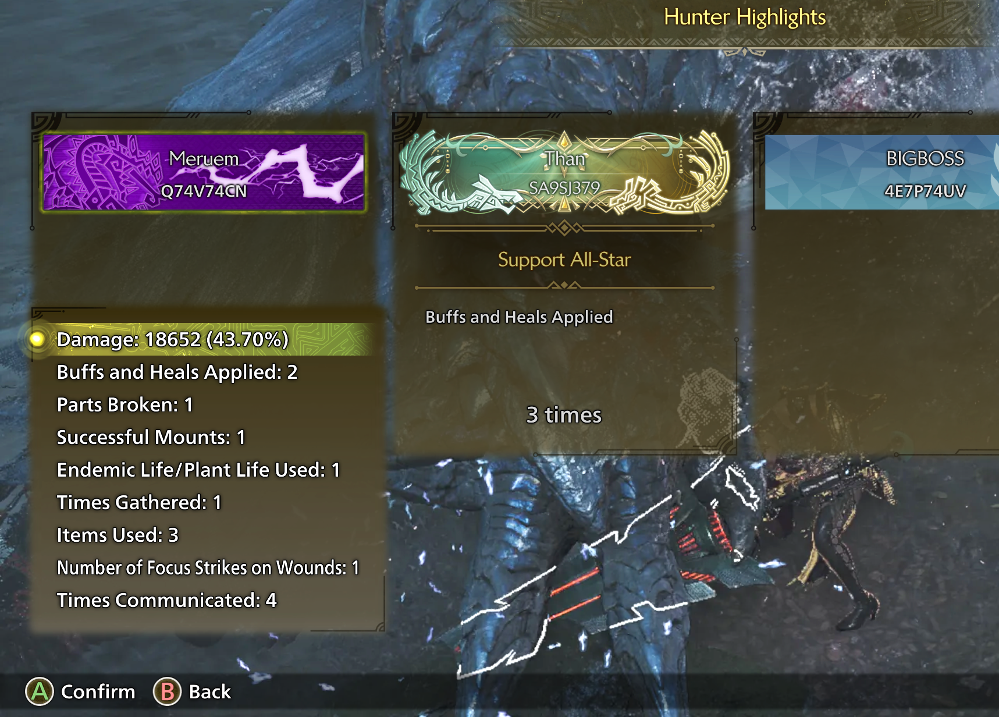
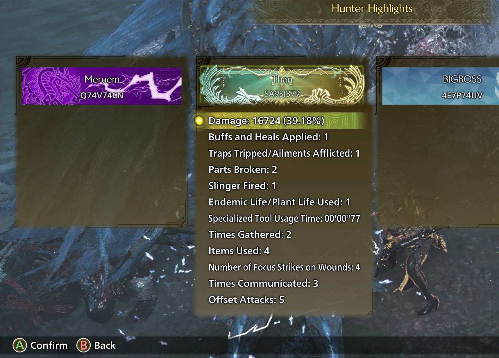
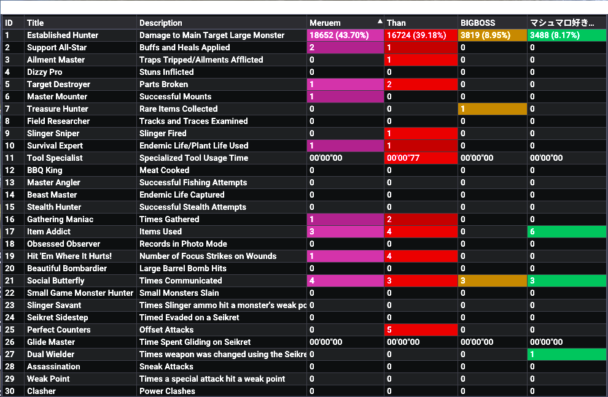
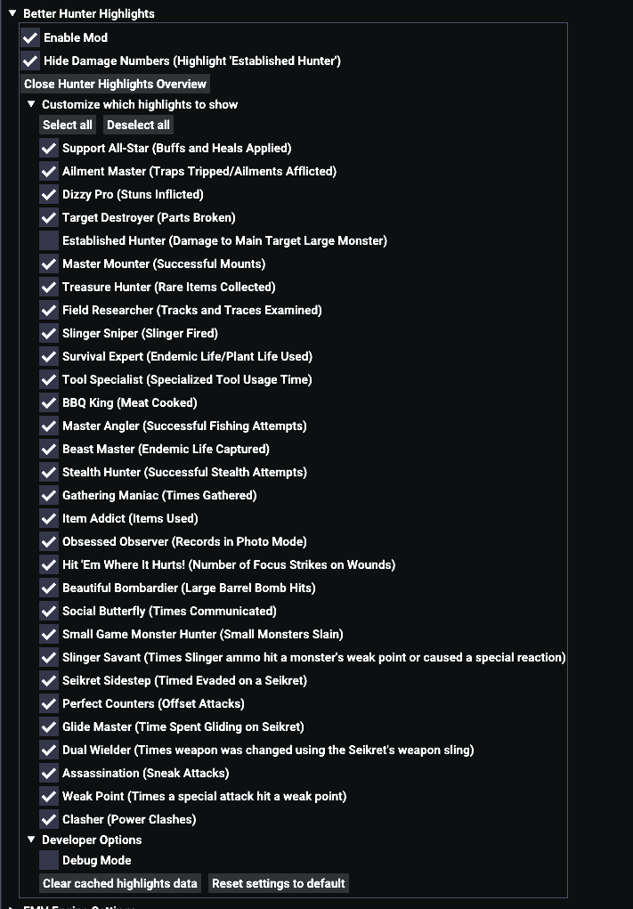

# Better Hunter Highlights - Monster Hunter Wilds Mod

## Features
- REFramework UI table with detailed Hunter Highlight information
- Hunter Highlights added to the quest result sub menus
- Option to hide the damage numbers (Reward 'Established Hunter')
- Settings to toggle each highlight on or off

## Requirements
- Requires [REFramework](https://www.nexusmods.com/monsterhunterwilds/mods/93)

## Installation
- Recommended is to use the Vortex Mod Manager from [Nexus Mods](https://www.nexusmods.com/monsterhunterwilds/mods/2561) and install the mod from there
- Alternatively, you can manually install the mod by downloading it from [Nexus Mods](https://www.nexusmods.com/monsterhunterwilds/mods/2561) or from the [GitHub Releases](https://github.com/thieleju/mhws-better-hunter-highlights/releases) page
  - If you install manually, make sure the `better_hunter_highlights.lua` script is in the `reframework/autorun` directory

## Submenu

## Table

## REFramework Settings
