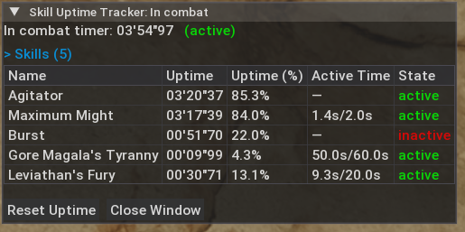
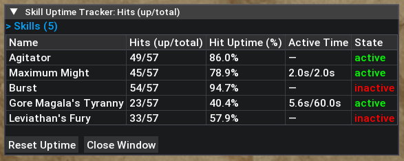
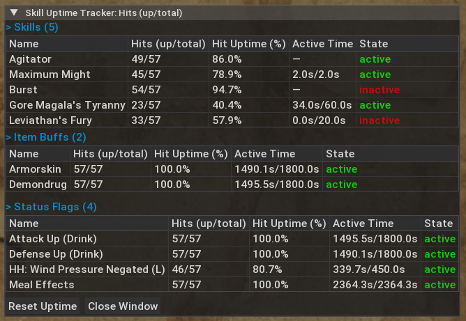
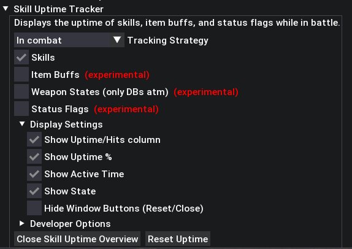

# Skill Uptime Tracker - Monster Hunter Wilds Mod

## Features

- Tracks uptime/duration of selected skills during hunts

## Requirements

- Requires [REFramework](https://www.nexusmods.com/monsterhunterwilds/mods/93)

## Installation

- Download from [Nexus Mods](https://www.nexusmods.com/monsterhunterwilds/mods/3249)
- Alternatively, download from GitHub Releases and ensure `skill_uptime_tracker.lua` is placed under `reframework/autorun`

## Usage

- After installation, configure options via REFramework menu and click `Show Skill Uptime Overview`

## Screenshots

